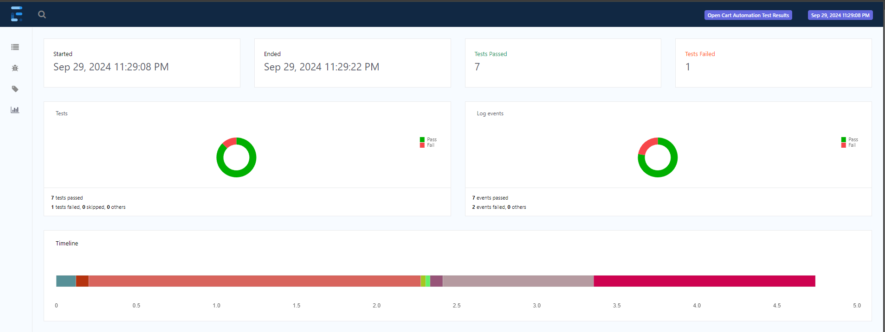

# Page Object Model (POM) Framework

## Overview

This repository contains a Page Object Model (POM) framework for SeleniumHybrideFramework, designed to streamline automated testing for web applications. The POM design pattern enhances test maintenance and improves readability by separating test logic from page-specific actions.

## Features

- **Modular Structure**: Each page of the application is represented by a separate class, promoting code reusability and organization.
- **Easy Maintenance**: Changes in the UI require minimal updates in the corresponding page class.
- **Readability**: Test scripts are clear and easy to understand, focusing on test logic rather than UI interactions.
- **Data-Driven Testing**: Supports integration with data sources for parameterized tests.
- **Cross-Browser Testing**: Capable of running tests across multiple browsers with minimal configuration.
- ** Data Driven
- ** GeneicUtils(ElementUtils,ExcelUtils,Cnstants,ErrorUtils)
- ** Infrastructure Setup
- ** Report(Extent)


```xml
			<dependency>
			<groupId>com.aventstack</groupId>
			<artifactId>extentreports</artifactId>
			<version>5.1.2</version>
			</dependency>
```
**Adding listeners in runner 
```xml

	<listeners>
		<listener
			class-name="com.qa.opencart.listerns.ExtentReportListener" />
	</listeners>
```
- **Surefire Plugin capabilities enable for regression suite run on different "env" bases
```xml
<build>
		<plugins>
			<plugin>
				<groupId>org.apache.maven.plugins</groupId>
				<artifactId>maven-compiler-plugin</artifactId>
				<version>3.8.1</version>
				<configuration>
					<source>11</source>
					<target>11</target>
				</configuration>
			</plugin>

			<plugin>
				<groupId>org.apache.maven.plugins</groupId>
				<artifactId>maven-surefire-plugin</artifactId>
				<version>2.20</version>

				<configuration>
					<forkCount>3</forkCount>
					<reuseForks>true</reuseForks>
					<suiteXmlFiles>
						<suiteXmlFile>
							<add your runner suite path></suiteXmlFile>
						<!-- <suiteXmlFile>${suiteXmlFile}</suiteXmlFile> -->
					</suiteXmlFiles>


				</configuration>

			</plugin>

		</plugins>


	</build>
```
##Command to run the suite through maven
- mvn clean install
- mvn clean install -Denv="<provide your desire environment>"

## Getting Started

### Prerequisites

- Java (1.8)
- Maven (4.0.0)
- WebDriver (ChromeDriver, GeckoDriver, etc.)


### Installation

1. Clone the repository:

  git clone https://github.com/shivendersingh/SeleniumHybrideFramework.git
  